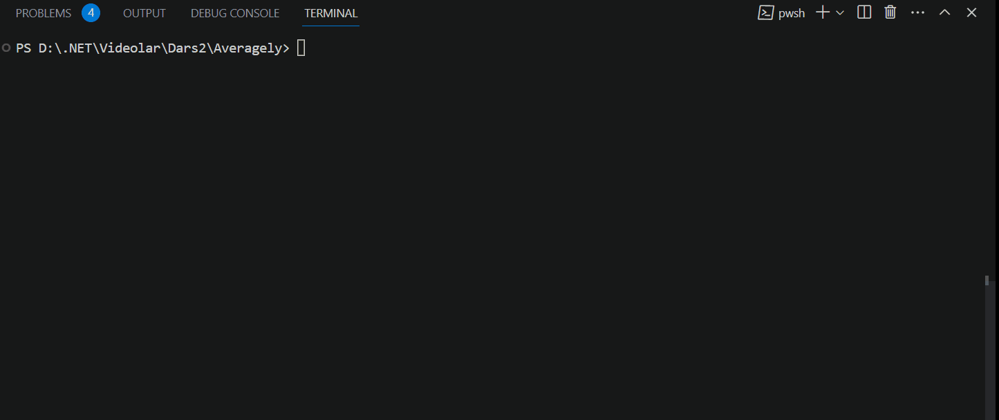

# Averagely v2.0
This is an improved version **[v1.0](https://github.com/Jarus95/Averagely/tree/releases/v1.0)**

This program will help you find student GPA

Have a look at `Program.cs` file and you can see how I have used:

* Console input/output
* Arithmetic operation to find student GPA
* Logical operations to what kind of student are you
* Loop operations

## Demo

## Release Notes

### **[v2.0](https://github.com/Jarus95/Averagely/tree/releases/v2.0)**

#### New Features
* You can choose how many subject calculate
* Program to ask you to try again

### **[v1.0](https://github.com/Jarus95/Averagely/tree/releases/v1.0)**

#### Features
* You can find the average of 5 subjects

## How to run locally
1. Press the green clone button and copy the git **[link](https://github.com/Jarus95/Averagely.git)**

2. Open your local folder and run terminal then enter the command *git clone **[link](https://github.com/Jarus95/Averagely.git)***

3. Open project and write _dotnet run_ command in terminal

