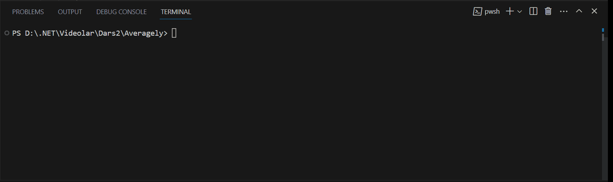

# Averagely
This program will help you find the average of 5 numbers

Have a look at `Program.cs` file and you can see how I have used:

* Console input/output
* Find the arithmetic average of numbers

## Demo
